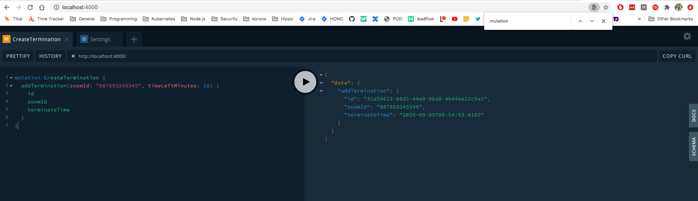
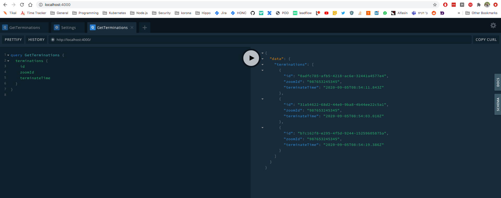

## timer-server

Uses [Apollo](https://www.apollographql.com/)/[GraphQL](https://graphql.org/)/[Nodejs](https://nodejs.org/en/) to accept requests to terminate a zoom-session and sends these notifications into [CockroachDB](https://www.cockroachlabs.com/)

## cURL Examples

### Get all existing terminations
```
curl 'http://localhost:4000/' -H 'Accept-Encoding: gzip, deflate, br' -H 'Content-Type: application/json' -H 'Accept: application/json' -H 'Connection: keep-alive' -H 'DNT: 1' -H 'Origin: http://localhost:4000' --data-binary '{"query":"query GetTerminations {\n  terminations {\n    zoomId,\n    ttl\n  }\n}\n# mutation CreateTermination {\n#   addTermination(zoomId: \"987654321\", ttl: 1599175200) {\n#     zoomId\n#     ttl\n#   }\n# }\n"}' --compressed
```

*Example output*
```
{
  "data": {
    "terminations": [
      {
        "id": "2fa1cee5-41fd-4880-8812-dd40dfbb587b",
        "zoomId": "987653245345",
        "terminateTime": "2020-09-05T00:55:10.445Z"
      },
      {
        "id": "46ab0752-8e2f-41ad-9415-4b46c848d33c",
        "zoomId": "987653245346",
        "terminateTime": "2020-09-05T00:55:16.357Z"
      },
      {
        "id": "8191aa3c-8213-4a72-98a1-91e4f6acbbd5",
        "zoomId": "987653245345",
        "terminateTime": "2020-09-05T00:55:22.093Z"
      }
    ]
  }
}
```

### Create a termination
```
curl 'http://localhost:4000/' -H 'Accept-Encoding: gzip, deflate, br' -H 'Content-Type: application/json' -H 'Accept: application/json' -H 'Connection: keep-alive' -H 'DNT: 1' -H 'Origin: http://localhost:4000' --data-binary '{"query":"mutation CreateTermination {\n  addTermination(zoomId: \"987653245345\", timeLeftMinutes: 10) {\n    id\n    zoomId\n    terminateTime\n  }  \n}"}' --compressed
```

*Example output*
```
{
  "data": {
    "addTermination": {
      "id": "f8545885-d68c-44ed-8909-5368b46c3352",
      "zoomId": "987653245345",
      "terminateTime": "2020-09-05T00:56:08.049Z"
    }
  }
}
```

We recommend piping the output into `jq`.

### Using the Playground

When running the server locally, we can access http://localhost:4000/ and run graphQL queries directly in the playground instead of using cURL.

Examples:

#### Create A Session Termination
```
mutation CreateTermination {
  addTermination(zoomId: "987653245345", timeLeftMinutes: 10) {
    id
    zoomId
    terminateTime
  }  
}
```


#### Get All Existing Terminations
```
query GetTerminations {
  terminations {
    id
    zoomId
    terminateTime
  }
}
```



## Motivation

Cigi is a Tikal fuseday project that was created on Sep 2020 in order to provide a slack chatbot that allows you to open a zoom-session for a few minutes inviting other channel members to join you for a ciggarette. 

Timer-server is one of cigi's micro-services and its roll is to get requests for terminations of zoom-sessions and save them on CockroachDB.

Per [Cigi Tech Design](https://gitlab.com/tikal-fuse/fuseday2020/group2/test/-/wikis/Cigi-tech-design) timer-server accepts graphQL requests from cigi-server and based on their input adds notifications to terminate existing zoom sessions at a specific timestamp.

## Installation

Assuming cockroachDB and the other relevant micro-services are already present. 

Simply do: `npm install`

## Setup

The following `env` variables may be configured either directly or via `vault` or a similar tool in Kubernetes:

### Server setup
* `SERVER_PORT` - on which port timer-server should run, defaults to 4000

### CockroachDB setup
* `DB_HOST` - defaults to `localhost`
* `DB_NAME` - defaults to `zoomkiller`
* `DB_PORT` - defaults to `26257`
* `DB_USER` - defaults to `maxroach`
* `DB_PWD` - defaults to `''` (empty string)

## Running

`npm start`

## Run tests

`npm test`

## API Reference

Requirements detailed [here](https://gitlab.com/tikal-fuse/fuseday2020/group2/test/-/issues/7)

## License

[Apache License 2.0](https://www.apache.org/licenses/LICENSE-2.0)